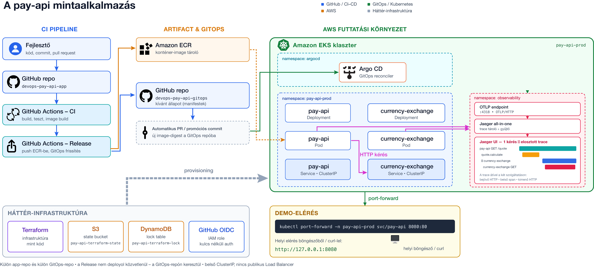

# pay-api-gitops

Külön repo a `pay-api` mintaalkalmazás infrastruktúra-, GitOps- és Kubernetes-oldalához.

## Tartalom

- `bootstrap/`: egyszer futtatható Terraform a state backendhez
- `terraform/`: ECR, EKS, IAM és OIDC alapok
- `platform/argocd/`: Argo CD telepítési erőforrások
- `platform/jaeger/`: Jaeger tracing erőforrások
- `apps/pay-api-prod/`: Helm chart a `pay-api` szolgáltatáshoz
- `apps/currency-exchange-prod/`: Helm chart a `currency-exchange` szolgáltatáshoz
- `clusters/prod/`: Argo CD `Application` manifestek
- `docs/`: hallgatói és üzemeltetési dokumentáció

## Működési modell

1. Az alkalmazásrepó `main` merge után image-eket pushol az ECR-be.
2. Ugyanaz a workflow pull requestet nyit ebben a repóban.
3. A PR frissíti a két alkalmazás `values-prod.yaml` fájljában az image digesteket.
4. Merge után az Argo CD autosync deployolja a változást az EKS klaszterre.

## Hallgatói útmutató

A teljes, lépésről lépésre követhető útmutató itt található:

[docs/hallgatoi-utmutato.md](/work/git/gde_devops/pay-api-gitops/docs/hallgatoi-utmutato.md)

Ez az útmutató tartalmazza:

- a helyi futtatást;
- a GitHub repo-k létrehozását;
- a Terraform backend és infrastruktúra felépítését;
- az Argo CD és a három alkalmazás telepítését;
- az Argo CD UI elérését és a kezdeti admin jelszó lekérését;
- a Jaeger UI és a `pay-api` kipróbálását;
- a szükséges konfigurációs placeholderek kitöltését.

## Architektúraábra

## Fontos elv

A Gitben tárolt fájlokban ne tárolj:
- AWS access key-t;
- AWS secret key-t;
- GitHub tokent;
- személyes AWS account ID-t;
- személyes GitHub org- vagy felhasználónevet fixen beégetve.

Ha konkrét környezethez kötött értéket használsz, azt nem követett konfigurációs fájlban kezeld.
